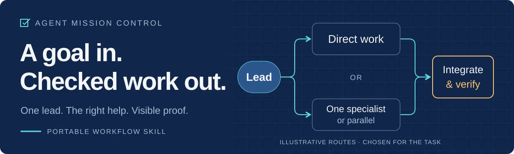

<p align="center">
  <picture>
    <source media="(max-width: 600px)" srcset="docs/assets/mission-path-mobile.svg" />
    
  </picture>
</p>

<h1 align="center">Agent Mission Control</h1>
<p align="center"><strong>Stop babysitting your coding agent.</strong><br />
One skill that makes the agent choose the right amount of help,<br />and show which checks actually ran before it says “done”.</p>

<p align="center">
  <a href="https://github.com/byensitmagnus/agent-mission-control/actions/workflows/validate.yml"></a>
  <a href="LICENSE"></a>
  
</p>

```bash
npx skills add byensitmagnus/agent-mission-control
```

<p align="center">16 small files (about 55 KB). No server, no API key, no extra model.<br />
<a href="docs/getting-started.md"><strong>Get started →</strong></a> ·
<a href="docs/task-guide.md">Task recipes</a> ·
<a href="docs/how-it-works.md">How it works</a> ·
<a href="docs/evidence.md">Results &amp; limits</a></p>

## Why

Coding agents tend to fail in three familiar ways. AMC gives the lead agent one
rule set for each:

| What goes wrong | What AMC tells the lead to do |
|---|---|
| **A swarm for a one-line fix.** Five subagents, five context dumps, one tiny change. | Keep small work direct. Delegate only when a job earns its coordination cost. |
| **“All tests pass”** when no test ran. | Report only checks that actually ran on the current artifact. Missing proof stays **NOT VERIFIED**. |
| **Lost after a long session.** The context fills up and work starts over. | Keep a compact mission record and reconcile it with the files before trusting it. |

## Three routes, one lead

The lead picks the smallest route that can finish the job and changes route
when new evidence says so:

1. **Direct.** The lead edits, checks and finishes. This is the default.
2. **One specialist.** A bounded job gets focused expertise or a fresh context.
   The handoff names inputs, write scope and the acceptance check.
3. **Parallel.** Only for jobs that do not need each other's output. Parallel
   writers need host isolation such as worktrees.

The lead owns integration and the final verdict: **PASS**, **FAIL**,
**NOT VERIFIED** or **BLOCKED**. A worker saying “done” is input, not acceptance.

## Start in 30 seconds

1. **Install** in your project: `npx skills add byensitmagnus/agent-mission-control`.
   As a Claude Code plugin instead: `/plugin marketplace add https://github.com/byensitmagnus/agent-mission-control`,
   then `/plugin install agent-mission-control@amc`.
   Prefer Git + Python or plain copy? See [other install paths](docs/getting-started.md#1-install-the-skill).
2. **Select it:** `/agent-mission-control` in Claude Code (`/agent-mission-control:agent-mission-control`
   if installed as a plugin), `$agent-mission-control` in Codex, `/` in Cursor. [All hosts](docs/getting-started.md#2-select-the-installed-copy).
3. **Give it work you already need** (`$` is Codex syntax; use your host's command from step 2):

```text
$agent-mission-control

Deliver: [the outcome I need].
Done when: [two observable criteria].
Preserve: [behavior, data, constraints].

Inspect the project. Choose useful help.
Finish the authorized local work.
Run relevant checks. Show the result,
evidence and remaining limits.
Stop before push or external changes.
```

## What “done” looks like

An illustrative delivery (format example, not a measured run):

```text
Result:    zero now exports as 0; missing values stay blank
Changed:   src/export.py, tests/test_export.py
Checked:   python -m unittest tests.test_export — passed on the changed source
Not done:  spreadsheet import untested; no deployment
Status:    PASS for the identified artifact
```

If someone will run a generated script or installer, that file is what gets
checked. A green check on the source alone leaves the package NOT VERIFIED.
[Full delivery example →](docs/task-guide.md#what-a-completed-delivery-looks-like)

## Built with itself

AMC is developed with AMC. The
[readiness review](docs/reviews/readiness-2026-09-24.md#product-outcome-and-workflow-trace)
traces one real delivery: scoped jobs in separate worktrees, a review that
returned four findings (three confirmed and repaired, one rejected against the
actual code), then merge after green CI. It is an observed trace, not a benchmark.

## Honest limits

- General gains in cost, speed or quality are **not established**. We do not
  claim them. [What was actually checked](docs/evidence.md).
- AMC is instructions. Your host decides which tools, subagents and permissions exist.
- Small models need the rules in plain sight. With Claude Haiku 4.5, 9 of 10
  repository cases passed after the verdict rules moved into `SKILL.md` (7 of 10
  before). One run per case. Haiku still approved a risky migration on its own
  tests in 5 of 7 runs across candidate.12 and .13. candidate.14 rebuilds that
  gate from published practice and is not re-measured. [Haiku results](evals/haiku-smoke-2026-09-25.md)
- The CI badge covers engineering checks on `main`, not agent behavior.

## Pick the right tool

AMC fits when you want adaptive execution **inside the coding assistant you
already use**. A desktop coordination platform fits when you want a separate
live board. A model profile fits when you want fixed role/model presets.
[Compare by need →](docs/choosing.md)

| I want to… | Go to… |
|---|---|
| Install, select or troubleshoot | [Getting started](docs/getting-started.md) · [Hosts](docs/hosts.md) |
| Do useful work | [Task recipes](docs/task-guide.md) |
| Understand the workflow | [How it works](docs/how-it-works.md) · [The skill itself](skills/agent-mission-control/SKILL.md) |
| Inspect evidence and sources | [Evidence](docs/evidence.md) · [Field state](docs/field-state.md) · [Sources](docs/sources.md) |
| Contribute | [Development](docs/development.md) · [Contributing](CONTRIBUTING.md) |

**Versions:** the installs above use `main`. The latest tagged ZIP,
[candidate.15](https://github.com/byensitmagnus/agent-mission-control/releases/tag/v0.2.0-candidate.15),
contains the same runtime, with checksums. The docs map is [docs/README.md](docs/README.md).

## Help it get better

Tried it on real work? [Share what happened](https://github.com/byensitmagnus/agent-mission-control/issues/new?template=experience.yml):
the goal, what the agent did, the result you checked and where you had to step
in. Remove private information first. If AMC saved you a babysitting session,
a ⭐ helps other developers find it.

[Security](SECURITY.md) · [MIT license](LICENSE) ·
[Development history](docs/history/through-candidate.8.md)

Made by **[Byens IT](https://byens-it.dk)** for people building with AI.
