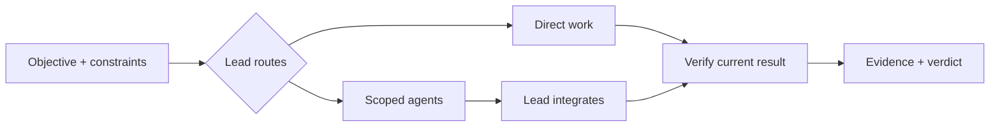

<p align="center">
  
</p>

# Agent Mission Control

**One objective. The smallest useful workflow. Evidence you can inspect.**

Agent Mission Control is an open-source **AI agent orchestration skill for Codex**
and compatible coding-agent hosts. This standalone candidate brings adaptive
workflows, scoped context packs, measurable optimization and independent
verification behind one entrypoint. Your host provides agents and tools; AMC
selects the useful work and the context each task needs.

<p>
  <a href="https://github.com/byensitmagnus/agent-mission-control/actions/workflows/validate.yml"></a>
  <a href="https://github.com/byensitmagnus/agent-mission-control/releases/tag/v0.1.0"></a>
  
  <a href="LICENSE"></a>
</p>

[Use the skill](#use-the-skill) · [Build and install](#build-and-install) · [Optional Codex profile](examples/codex/README.md) · [Evaluation report](evals/v0.2-standalone-candidate.md)

> **Experimental candidate — not a verified replacement for v0.1.0.**
> Six focused agent sessions exposed both useful behavior and correctness
> failures. General engineering gains, token savings and native project-role
> loading remain **NOT VERIFIED**. See the [full results and limitations](evals/v0.2-standalone-candidate.md).

## A workflow that fits the task



Scouting, optimization, independent review, repair and post-run learning are
added only when the task warrants them. Native sessions and tools remain with
Codex or the host. There is no extra daemon, mandatory companion skill or
custom workflow engine to install.

| Included | Purpose |
|---|---|
| Task-specific context packs | Give each worker the relevant question, inputs, authority and acceptance check. |
| Conditional workflow references | Load routing, optimization, review or recovery detail when useful. |
| Resource and learning boundaries | Use observed usage; evaluate lessons separately from live execution. |
| Portable packages | Build the same runtime as a skill folder or Codex plugin. |

Context packs limit handoffs; they do not create a security sandbox. Shared
host instructions and filesystem access may still apply.

[Source and license decisions](references/provenance.md) explain adopted and
rejected mechanisms. [MISSION](MISSION.md) records development state.
The [earlier qualification](evals/v0.2-qualification.md) and
[iteration 2 report](evals/v0.2-control-candidate.md) preserve previous results.

## One execution owner

| Need | Owner |
|---|---|
| Ordinary edit or understood dependency chain | Lead's normal implementation/check loop |
| One focused independent job | Native scoped worker when it adds useful value |
| Substantial independent workstreams | AMC work/context routing; native agents |
| Measured candidate optimization | AMC frozen evaluator, recoverable incumbent and bounded attempts |
| Cross-phase state, recovery and final acceptance | Lead with Mission Control |
| Offline learning | Separate completed-task workflow |

The entrypoint loads relevant references for work/capability routing, optimization,
review, recovery, resource checks or separate learning. Context Diamond, AVO and
SkillOpt are credited design sources, not required installations. Domain skills
remain optional technical help. Explicitly requested procedures retain one owner;
do not duplicate their loops or bypass their gates.

If optimization delegates jobs, the lead retains selection and workers own only
those bounded jobs. Reuse the existing tracker and adequate current review;
Mission Control does not create an additional team or verification cycle.
The lead still inspects artifacts and executes relevant acceptance checks.
Required independent proof is never invented when only one agent is available.

## Use the skill

```text
$agent-mission-control

Prepare this application for release. Preserve existing user data, delegate
independent work where useful, verify it, and stop before deploy.
```

A bounded handoff can be this short:

```text
Goal: Check deadline behavior in transport.py against requirements.md.
Why independent: Storage review does not need this result.
Base: The lead's recorded commit plus current transport.py snapshot.
Owner: Read-only transport.py and requirements.md; preserve others' work.
Authority: Local reads and non-mutating checks; no external changes.
Return: Boundary results, file anchors and risks; verify before/at/after expiry.
```

Use only relevant context. [Work and capability routing](references/packets.md) covers ownership
transfers; the [populated packet](templates/context-packet.md) gives a longer
example when needed.

## Resume from facts

For a long mission, reuse its existing tracker or the
[Mission View template](templates/mission-view.md). Record gates, owners,
commands, results and artifact identities. On resume, reconcile that record
with HEAD, uncommitted files, test output and still-running workers.
An old PASS cannot override a current failure. See
[reconciliation](references/resume.md).

Safe local edits, tests and repairs continue within existing authority.
Stop at an unauthorized external or destructive action. A local PASS grants
no deployment permission. The [release example](examples/fps-booster-release.md)
is illustrative, not measured proof.

## Build and install

The repository root is the only canonical skill source. Python 3.11+ builds
both formats into **new paths outside the source tree**:

```bash
python scripts/package_plugin.py ../amc-packages/skill/agent-mission-control --format skill --archive ../amc-packages/skill.zip
python scripts/package_plugin.py ../amc-packages/plugin/agent-mission-control --archive ../amc-packages/plugin.zip
```

| Format | Contents | Installation |
|---|---|---|
| Skill | SKILL.md, references, templates, UI metadata, assets and license | Place the built folder in a new `.agents/skills/agent-mission-control` directory in the intended project |
| Codex plugin | `.codex-plugin/plugin.json` and the same skill under `skills/agent-mission-control/` | Register the built plugin through a configured marketplace, then install with the host's Plugins browser |

See [OpenAI's plugin setup guide](https://developers.openai.com/codex/plugins)
for marketplace and installation support in the actual client. Start a new
session after installation. Plugin host installation and discovery are
**NOT VERIFIED** here; package validation is a separate check. No project
configuration or custom agents are installed by the builder.

Existing destinations and archives are refused. The builder rejects traversal,
linked paths and outputs inside the source. The default source must be this
repository with the expected origin; packaging an explicitly supplied trusted
snapshot is a Python API operation for tests and offline builds. Source bytes
are copied unchanged. Tracked text uses LF for portable Git snapshots; an
explicit external snapshot is copied without normalization. ZIP entry order,
timestamps and permissions are fixed.
Failures may leave a newly created partial output for inspection.

For updates, build a new version in a separate directory, compare it with the
installed files and preserve local customizations before an authorized switch.
Do not blindly overwrite. To uninstall a skill, remove only its confirmed
installation directory after preserving edits; uninstall a plugin through the
host's plugin manager. The builder performs neither action.

The [optional Codex profile](examples/codex/README.md) shows independently configured lead and child models/reasoning. It is not loaded by the
portable runtime. Actual cost, token savings and broad compatibility are
not established.

## Verification and development

```bash
python scripts/validate.py
python scripts/test_validate.py
python scripts/test_prepare_eval.py
python scripts/test_package_plugin.py
```

These check package structure and safety, including negative controls and
disposable fixture integrity. They do not prove agent behavior. The
[11-case behavioral suite](evals/README.md) covers discovery, direct work,
dependencies, ownership, resume, measurable variation, release risk and
authority. Compare all three sources under the same frozen rubric.

[Previous qualification](evals/v0.2-qualification.md) preserves the failed
comparison and its limitations. [Offline skill evolution](CONTRIBUTING.md)
uses completed-run failures and held-out replay; it never rewrites the skill
during the mission it governs. Read [security guidance](SECURITY.md) before
reporting vulnerabilities.

[MIT](LICENSE) © 2026 Byens IT. Independent project; no endorsement by OpenAI,
NVIDIA, Microsoft or the projects that inspired it.
