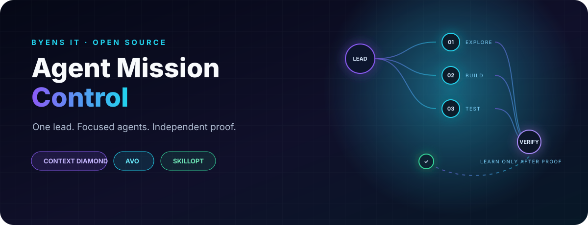

<p align="center">
  
</p>

<p align="center"><strong>One lead. Focused agents. Measurable progress. Independent proof.</strong></p>

<p align="center">
  <a href="https://github.com/byensitmagnus/agent-mission-control/actions/workflows/validate.yml"></a>
  <a href="https://github.com/byensitmagnus/agent-mission-control/releases"></a>
  <a href="LICENSE"></a>
</p>

Agent Mission Control helps a lead agent finish complex software work with
clear ownership and evidence. Small edits stay direct. Independent substantial
jobs can run in parallel. Dependencies and integration stay serialized.
Long missions resume from the workspace, not yesterday's summary.

This is a **local v0.2 candidate**, not a published upgrade. Controlled routing
improvement over v0.1.0 and 358680d is **NOT VERIFIED**. There is no daemon,
database, telemetry, mandatory model team or companion-skill dependency.

## Direct work or fan-out?

| Task | Execution |
|---|---|
| Fix a heading or update a function and its callers | Lead edits and checks directly |
| Independent substantial transport and storage investigations | Scoped workers, if coordination is worthwhile |
| Shared API, then dependent adapters | Lead fixes the interface; dependent work waits |
| Risky migration or release | Preserve baseline and recovery; obtain separate proof |
| Measured optimization | Freeze evaluator, compare candidates, retain verified incumbent |

The lead always owns architecture, acceptance, integration and final evidence.
Multiple files alone do not justify orchestration. One available agent can
work serially; required independent proof is never invented.

## Use the skill

```text
$agent-mission-control

Prepare this application for release. Preserve existing user data, delegate
independent work where useful, verify it, and stop before deploy.
```

A minimal Context Packet can be this short:

```text
Goal: Check deadline behavior in transport.py against requirements.md.
Why independent: Storage review does not need this result.
Base: The lead's recorded commit plus current transport.py snapshot.
Owner: Read-only transport.py and requirements.md; preserve others' work.
Authority: Local reads and non-mutating checks; no external changes.
Return: Boundary results, file anchors and risks; verify before/at/after expiry.
```

Use only relevant context. [Delegation](references/packets.md) covers ownership
transfers; the [populated packet](templates/context-packet.md) gives a longer
example when needed.

## Resume from facts

For a long mission, reuse its existing tracker or the
[Mission View template](templates/mission-view.md). Record gates, owners,
commands, results and artifact identities. On resume, reconcile that record
with HEAD, uncommitted files, test output and still-running workers.
An old PASS cannot override a current failure. See
[reconciliation](references/resume.md).

Safe local edits, tests and repairs continue within existing authority.
Stop at an unauthorized external or destructive action. A local PASS grants
no deployment permission. The [release example](examples/fps-booster-release.md)
is illustrative, not measured proof.

## Build and install

The repository root is the only canonical skill source. Python 3.11+ builds
both formats into **new paths outside the source tree**:

```bash
python scripts/package_plugin.py ../amc-packages/skill/agent-mission-control --format skill --archive ../amc-packages/skill.zip
python scripts/package_plugin.py ../amc-packages/plugin/agent-mission-control --archive ../amc-packages/plugin.zip
```

| Format | Contents | Installation |
|---|---|---|
| Skill | SKILL.md, references, templates, UI metadata, assets and license | Place the built folder in a new `.agents/skills/agent-mission-control` directory in the intended project |
| Codex plugin | `.codex-plugin/plugin.json` and the same skill under `skills/agent-mission-control/` | Register the built plugin through a configured marketplace, then install with the host's Plugins browser |

See [OpenAI's plugin setup guide](https://developers.openai.com/codex/plugins)
for marketplace and installation support in the actual client. Start a new
session after installation. Plugin host installation and discovery are
**NOT VERIFIED** here; package validation is a separate check. No project
configuration or custom agents are installed by the builder.

Existing destinations and archives are refused. The builder rejects traversal,
linked paths and outputs inside the source. The default source must be this
repository with the expected origin; packaging an explicitly supplied trusted
snapshot is a Python API operation for tests and offline builds. Source bytes
are copied unchanged. Tracked text uses LF for portable Git snapshots; an
explicit external snapshot is copied without normalization. ZIP entry order,
timestamps and permissions are fixed.
Failures may leave a newly created partial output for inspection.

For updates, build a new version in a separate directory, compare it with the
installed files and preserve local customizations before an authorized switch.
Do not blindly overwrite. To uninstall a skill, remove only its confirmed
installation directory after preserving edits; uninstall a plugin through the
host's plugin manager. The builder performs neither action.

The [optional Codex profile](examples/codex/README.md) shows capability-based
roles using Astra/Luna/Terra/Sol as example names. It is not loaded by the
portable runtime. Actual cost, token savings and broad compatibility are
not established.

## Verification and development

```bash
python scripts/validate.py
python scripts/test_validate.py
python scripts/test_prepare_eval.py
python scripts/test_package_plugin.py
```

These check package structure and safety, including negative controls and
disposable fixture integrity. They do not prove agent behavior. The
[11-case behavioral suite](evals/README.md) covers discovery, direct work,
dependencies, ownership, resume, measurable variation, release risk and
authority. Compare all three sources under the same frozen rubric.

[Current evidence](evals/v0.2-candidate-log.md) distinguishes executed checks
from missing behavioral proof. [Offline skill evolution](CONTRIBUTING.md)
uses completed-run failures and held-out replay; it never rewrites the skill
during the mission it governs. Read [security guidance](SECURITY.md) before
reporting vulnerabilities.

[MIT](LICENSE) © 2026 Byens IT. Independent project; no endorsement by OpenAI,
NVIDIA, Microsoft or the projects that inspired it.
