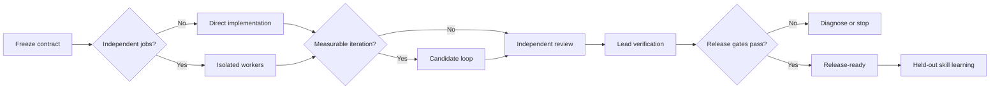

<p align="center">
  
</p>

<p align="center">
  <strong>One lead. Focused agents. Measurable progress. Independent proof.</strong>
</p>

<p align="center">
  <a href="https://github.com/byensitmagnus/agent-mission-control/actions/workflows/validate.yml"></a>
  <a href="https://github.com/byensitmagnus/agent-mission-control/releases"></a>
  <a href="LICENSE"></a>
</p>

`agent-mission-control` is a portable agent skill for complex engineering work:
major refactors, performance optimization, migrations, multi-surface builds,
and release-critical changes.

It is not a swarm launcher. A lead agent freezes the goal and proof contract,
delegates only genuinely independent work, runs measurable candidate loops when
needed, and accepts a result only after fresh verification.

## The control loop



## Why it works

| Layer | Owns | Never owns |
|---|---|---|
| Lead | Goal, architecture, scope, integration, final evidence | Rubber-stamping worker claims |
| Workers | One bounded task and its evidence | Changing the goal or evaluator |
| Candidate loop | One measurable hypothesis at a time | Parallel mutation of the same candidate |
| Verifier | Trying to disprove the result | Approving its own implementation |
| Learning loop | Held-out skill improvement after the run | Rewriting live rules mid-release |

The core separation is deliberate:

- **Delegation** scales independent work.
- **Variation** improves a measurable candidate.
- **Verification** proves the selected result.
- **Learning** improves future runs after the current run is closed.

## Install

### Global Codex skill

```bash
git clone https://github.com/byensitmagnus/agent-mission-control.git ~/.agents/skills/agent-mission-control
```

### Project-local skill

```bash
git clone https://github.com/byensitmagnus/agent-mission-control.git .agents/skills/agent-mission-control
```

Then invoke it explicitly:

```text
$agent-mission-control

Prepare this application for release. Preserve existing user data, run
independent work in parallel where safe, and stop before deploy.
```

Codex may also select the skill automatically when a task matches its
description.

## Works standalone

No runtime dependency is required. If these companion skills are installed,
Mission Control delegates their specialized phases instead of duplicating them:

- `context-diamond` — dependency-aware fan-out, contracts, and verification.
- `avo` — candidate lineage and evaluator-driven repair.
- `skillopt-sleep-learned` — validated release and staging lessons.
- `skillopt-sleep` — offline, held-out-gated skill evolution, based on
  [Microsoft SkillOpt](https://github.com/microsoft/SkillOpt).

## Use it for

- architecture-changing refactors;
- performance work with a reproducible benchmark;
- installers, migrations, and data-preserving upgrades;
- dashboards or apps spanning several independent surfaces;
- release preparation where CI alone is not enough.

Skip it for copy changes, routine website edits, obvious one-file fixes, and
linear tasks where a single agent can finish and verify the work directly.

## Design influences

Mission Control adapts ideas from:

- [Agent Orchestrator](https://github.com/Untrivial-ai/agent-orchestrator) —
  persistent lead ownership, isolated workers, and status derived from facts;
- [Codex Astra/Luna Orchestrator](https://github.com/donvito/codex-astra-luna-orchestrator) —
  strong-lead/efficient-worker model routing and independent review;
- [NVIDIA AVO](https://arxiv.org/abs/2603.24517) — recoverable candidate
  lineage, execution feedback, and supervisor intervention;
- [Microsoft SkillOpt](https://github.com/microsoft/SkillOpt) — bounded textual
  skill edits accepted through held-out validation.

This repository contains an independent workflow synthesis. It is not
affiliated with or endorsed by OpenAI, NVIDIA, Microsoft, or the referenced
projects.

## Validate

```bash
python scripts/validate.py
```

The validator uses only Python's standard library. CI runs it on every push and
pull request.

## Contributing and security

Small, evidence-backed improvements are welcome. Read [CONTRIBUTING.md](CONTRIBUTING.md)
before opening a pull request. Report security problems through
[SECURITY.md](SECURITY.md), not a public issue.

## License

[MIT](LICENSE) © 2026 Byens IT.
