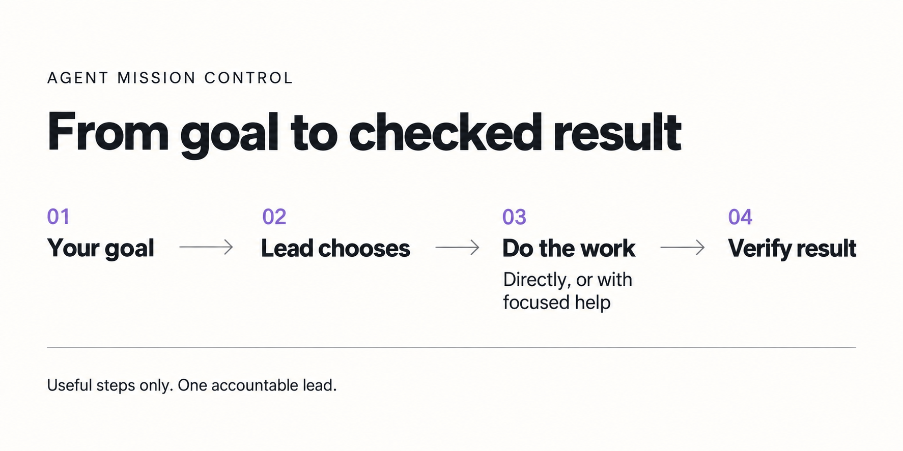

  

<h1 align="center">Agent Mission Control</h1>

<strong>Give your AI a goal. Give the work a clear path.</strong>

Adaptive workflows, focused context and inspectable results — inside your coding assistant.

  
  
  

  <a href="docs/getting-started.md"><strong>Get started</strong></a> ·
  <a href="docs/how-it-works.md">See the workflows</a> ·
  <a href="docs/sources.md">Explore the sources</a> ·
  <a href="https://github.com/byensitmagnus/agent-mission-control/releases/tag/v0.2.0-candidate.4">Download</a>

## Less coordinating. More useful work.

You should not have to remind your assistant to split the work, give each agent
the right context, check its results and remember where it stopped.

**AMC is an open-source orchestration skill for Codex.** A skill is a reusable
set of instructions for your assistant. AMC helps the lead agent choose a workflow,
bring in focused help when useful, and check the result against your goal.
It uses your host's existing tools and agents; there is no extra server to run.

| Your task | The intended workflow |
|---|---|
| Fix a typo | The lead edits and checks it. |
| Build a feature with separate work areas | Focused agents investigate or implement their parts; the lead integrates and checks. |
| Prepare a difficult release | Preserve progress, investigate failures, repair, and verify the relevant release gates. |

These are workflow examples. The route changes with the task, available tools and
your permissions. [Walk through all three scenarios →](docs/how-it-works.md)

## Start here

[Download the skill ZIP](https://github.com/byensitmagnus/agent-mission-control/releases/download/v0.2.0-candidate.4/agent-mission-control-skill.zip)
and follow the [short setup guide](docs/getting-started.md). It includes a prompt
you can give Codex to handle installation for you.

**First time?** Start with the [small read-only task](docs/getting-started.md#3-try-a-small-first-task).
AMC reads your project's README and returns its purpose, one use case and one
limitation, with references to README sections. No project files are changed
and no project checks are run.

Then give it the bug, feature or release task you actually need. If more than one
AMC entry appears, choose the installed copy inside your project.

**New to this?** Use your current model and normal permissions. The optional
[Sol / Terra / Luna profile](examples/codex/README.md) is for people who want
to configure individual roles; it is not required.

## How the work moves

The lead chooses direct work or useful independent help, integrates any delegated
results, and checks the current artifact against your goal.

A **context pack** gives a worker its question, relevant files, boundaries and
acceptance check. Research does not need an unrelated implementation transcript.
The lead keeps the overall picture. Shared host instructions and permissions
still apply.

Long work keeps a recoverable record. Optimization is used when useful feedback
or a stable measure exists. Learning from completed work stays separate.
[Explore the decisions, repair paths and examples →](docs/how-it-works.md)

## Built from research and practical ideas

AMC brings selected mechanisms together in one portable skill. These are design
sources, not extra products you must install.

| Source | What we adapt |
|---|---|
| Context Diamond | Independent work, focused handoffs and clear ownership. |
| Local AVO + NVIDIA AVO | Execution feedback, recoverable progress and bounded candidate selection. |
| Microsoft SkillOpt + local learning skills | Separate lesson proposals from live execution and evaluate empirical claims appropriately. |
| Untrivial + donvito orchestrators | Reconcile current state; configure focused roles using native host capabilities. |
| OpenAI, Anthropic and Google research/docs | Progressive context loading, capable leads, incremental work and selective delegation. |

[Exact repositories, source pins and runtime locations →](docs/sources.md)

[Research methods, findings and design decisions →](docs/research-basis.md)

## What is ready today?

**v0.2 candidate.4** includes the standalone skill, an equivalent Codex plugin
package, workflow examples, the research review and executable development checks.

Seven local check groups cover structure, packaging, fixture integrity,
preservation, usage accounting and public replays. Generated skill/plugin packages
also pass the official validators. Our design follows external research and
platform documentation; ordinary contributions do not require paid model studies.

The candidate is for early use and feedback. Host capabilities vary, and AMC
does not promise a particular cost or quality improvement. See
[compatibility and setup](docs/getting-started.md) and the
[engineering evidence](docs/research-basis.md#engineering-acceptance-and-ongoing-use).

Development history and real-task observations

[Real-task FPS pilot](evals/v0.2-fps-pilot.md) ·
[Bounded comparison](evals/v0.2-fps-comparison.md) ·
[Public replay checks](evals/fps-replays.md) ·
[Earlier qualification](evals/v0.2-qualification.md) ·
[Mission history](MISSION.md)

Earlier failures and limited comparisons remain available. They are development
evidence, not a substitute for external research or a general performance ranking.

## Help shape the next version

Try AMC on useful work you already need done. Tell us what it helped with, what
was confusing, or where it chose the wrong workflow.
[Share an experience](https://github.com/byensitmagnus/agent-mission-control/issues/new?template=experience.yml)
or [contribute an improvement](CONTRIBUTING.md). A clear example is useful; no
expensive benchmark is required.

[Build and check the source](docs/development.md) · [Security](SECURITY.md) · [MIT license](LICENSE)

Made by **[Byens IT](https://byens-it.dk)** for people building with AI.
Independent project; no endorsement by the organizations or projects cited.
