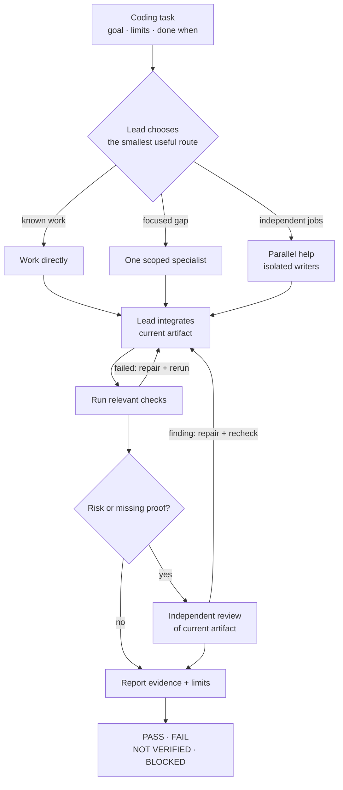

<h1 align="center">Agent Mission Control</h1>
<p align="center"><strong>One lead. The right help. Checks you can inspect.</strong></p>

<p align="center">
  <a href="https://github.com/byensitmagnus/agent-mission-control/actions/workflows/validate.yml"></a>
  <a href="LICENSE"></a>
</p>

**Agent Mission Control (AMC)** is a portable skill for Claude Code, Codex,
Cursor, Grok and Kimi. It helps a lead agent choose how much help a coding task
needs, then report the checks and limits of the result.

## How it works



**Only when needed:** a scout can clarify the route; an AVO-style loop can
compare measurable candidates with a frozen evaluator; an interrupted task
reconciles saved state with current files. [See the decision rules](docs/how-it-works.md).

## Try it on a real task

```bash
npx skills add byensitmagnus/agent-mission-control
```

In Codex, select `$agent-mission-control`. In Claude Code, select
`/agent-mission-control`. [Install and select it in other hosts](docs/getting-started.md).

```text
$agent-mission-control
Fix [a real issue in this repo].
Done when [an observable check passes].
Preserve [a behavior or constraint].
```

## Evidence and limits

AMC is a **workflow skill, not a graph runtime or release controller**.
Its PASS is advisory: candidate.16 smoke includes a false high-risk PASS, and
general gains in quality, cost or speed are not established.
[See the evidence](docs/evidence.md) · [Supported use](docs/prd.md#supported-operating-envelope).

[Task recipes](docs/task-guide.md) · [How it works](docs/how-it-works.md) ·
[Full docs](docs/README.md) · [Contribute](CONTRIBUTING.md) ·
[Share a real-work result](https://github.com/byensitmagnus/agent-mission-control/issues/new?template=experience.yml)

[Security](SECURITY.md) · [MIT license](LICENSE) · Made by [Byens IT](https://byens-it.dk).
