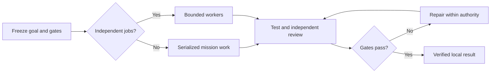

<p align="center">
  
</p>

<p align="center"><strong>One lead. Focused agents. Measurable progress. Independent proof.</strong></p>

<p align="center">
  <a href="https://github.com/byensitmagnus/agent-mission-control/actions/workflows/validate.yml"></a>
  <a href="https://github.com/byensitmagnus/agent-mission-control/releases"></a>
  <a href="LICENSE"></a>
</p>

Agent Mission Control is a portable skill for complex software work. It keeps
one lead responsible for architecture, focused workers responsible for bounded
jobs, and acceptance tied to independent evidence. A durable Mission View helps
long runs resume without trusting stale conversation summaries.

Use it for cross-cutting features, migrations, measured optimization and release
preparation. Simple edits and dependent chains stay with one agent. There is no
daemon, database, custom dashboard, telemetry or private companion-skill dependency.

## Install and activate

Skill-only activates `SKILL.md` with its `references/`, `templates/`, `assets/`
and `agents/openai.yaml`. Installing this repository root also copies its docs,
scripts, evals and inactive profile examples into the same skill directory. Ask Codex:

```text
Use $skill-installer to install https://github.com/byensitmagnus/agent-mission-control
at repository path . as agent-mission-control.
```

If that destination exists, inspect it first; never overwrite it silently.
A repository clone may instead be placed in a new
`.agents/skills/agent-mission-control` directory. Restart Codex after installation if the skill is not visible.

```text
$agent-mission-control

Prepare this application for release. Preserve existing user data, delegate
independent work where useful, verify it, and stop before deploy.
```

The portable core keeps your selected lead. The optional
[Astra-led Codex profile](examples/codex/README.md) selects Astra as root, Luna
for research, Terra for implementation/verification and Sol for independent
review, with at most three concurrent subagents. Model availability varies.
Applying the profile is a separate explicit setup action; review the diff and
get acceptance before merging existing config or agent files. Nothing
installs these files or changes `AGENTS.md` automatically.

Build a local plugin bundle from this checkout with a new destination:

```bash
python scripts/package_plugin.py work/plugin/agent-mission-control
```

The bundle contains the skill, UI assets and license. It does not install Codex
config or custom agents. Existing destinations are refused. Host installation
and discovery are **NOT VERIFIED**; this command only builds the package.

## During a mission

Routine edits finish with the lead's proportionate check. This diagram applies
to qualified missions:



Inspect workers in the Codex app subagent view or CLI `/agent`. Inspect durable
progress in the root-owned `MISSION.md`, based on the versioned
[Mission View template](templates/mission-view.md). It records ownership, hard
gates, evidence, blockers and the next action. On resume, root checks it against
HEAD, workspace state and artifacts. A local PASS never grants deploy permission.

The [FPS Booster example](examples/fps-booster-release.md) follows a mission
from scope through isolated work, verification, repair and the deploy boundary.
Its example status is illustrative, not measured proof.

## What is verified

With Python 3.11+, run:

```bash
python scripts/validate.py
python scripts/test_validate.py
python scripts/test_prepare_eval.py
python scripts/test_package_plugin.py
```

CI checks structure, metadata, paths, templates and disposable tooling controls.
It does not prove agent behavior. The [nine-case eval package](evals/README.md)
and [candidate evidence log](evals/v0.2-candidate-log.md) distinguish PASS from
NOT VERIFIED. The controlled behavioral comparison, host integration and cost
or token savings are not established.

## Contributing and security

Read [CONTRIBUTING.md](CONTRIBUTING.md) and [SECURITY.md](SECURITY.md).
Private vulnerability reporting was observed disabled; use the documented
contact-request route without publishing vulnerability details.

[MIT](LICENSE) © 2026 Byens IT. Independent project; no endorsement by OpenAI,
NVIDIA, Microsoft or the projects that inspired it.
