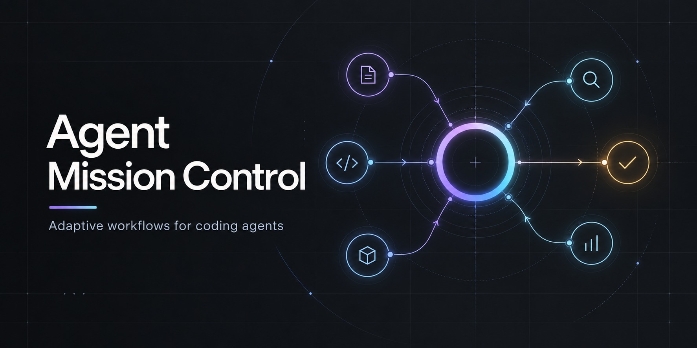
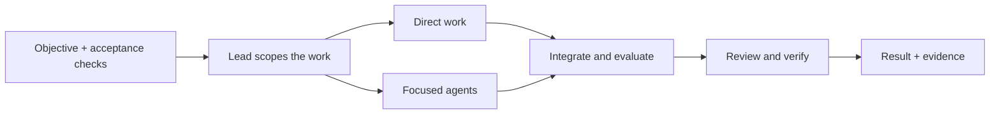

<p align="center">
  
</p>

# Agent Mission Control

**Give your coding agent an objective. Keep the work focused and the evidence visible.**

Agent Mission Control is an open-source **AI agent orchestration skill for Codex**
and compatible coding-agent hosts. It brings task routing, scoped context packs,
measurable optimization and independent verification into complex software work.

There is no server to run or new agent framework to adopt. Your existing host
provides the agents, tools and permissions; the skill supplies the working method.

<p>
  <a href="https://github.com/byensitmagnus/agent-mission-control/actions/workflows/validate.yml"></a>
  <a href="https://github.com/byensitmagnus/agent-mission-control/releases/tag/v0.1.0"></a>
  <a href="https://github.com/byensitmagnus/agent-mission-control/tree/codex/v0.2-adaptive"></a>
  <a href="LICENSE"></a>
</p>

[Quick start](#quick-start) · [How it works](#how-it-works) · [Version guide](#version-guide) · [Evidence](#evidence-and-limitations) · [Contributing](CONTRIBUTING.md)

## Quick start

From the project where you want to use the skill, clone the published version
into a **new** project-local skill directory:

```bash
git clone --branch v0.1.0 --depth 1 https://github.com/byensitmagnus/agent-mission-control.git .agents/skills/agent-mission-control
```

Start a new Codex session in that project, then give it a bounded objective:

```text
$agent-mission-control

Prepare this application for release. Preserve existing user data.
Delegate independent work where useful, verify the result, and stop before deploy.
```

Review the skill before using it. Keep an existing installation and its local
edits intact; clone into a separate directory when comparing versions.
The command installs instructions in this project, not global Codex settings.

## How it works



The graph illustrates responsibilities; it is not a requirement to spawn agents.

| Responsibility | What it contributes |
|---|---|
| Lead | Owns the goal, architecture, integration and final acceptance. |
| Focused workers | Receive a bounded task, relevant inputs, owned scope and an acceptance check. |
| Optimization | Uses a frozen evaluator, recoverable baseline and limited candidate attempts when improvement is measurable. |
| Verification | Checks current artifacts and test results; a worker's confidence is not proof. |
| Learning | Evaluates reusable lessons after the task, without rewriting the rules of an active run. |

Use it for refactors, migrations, performance investigations and release
preparation where coordination or separate proof adds value. Routine text edits
and clear one-file fixes usually fit the host's ordinary single-agent workflow.

### Context engineering, with boundaries

Give a researcher the question and relevant sources. Give an implementer the
requirements, interfaces and necessary findings. Give a reviewer the acceptance
criteria, current changes and evidence to challenge.

The lead carries the overview and passes required dependency results between
tasks. Context packs limit what is handed over; they do **not** create a security
sandbox or guarantee that host-level instructions and files are inaccessible.

## Version guide

| Version | What to expect | Where to start |
|---|---|---|
| **v0.1.0 — published** | The original portable workflow skill. Can defer specialized phases to installed companion skills. | [Release](https://github.com/byensitmagnus/agent-mission-control/releases/tag/v0.1.0) · [Skill](SKILL.md) |
| **v0.2 — experimental** | A standalone adaptive entrypoint, conditional references, resource checks, skill/plugin packaging and an optional Codex profile. | [Candidate and build instructions](https://github.com/byensitmagnus/agent-mission-control/tree/codex/v0.2-adaptive#build-and-install) |

The candidate chooses which workflow steps are useful for the task. It incorporates
mechanisms inspired by Context Diamond, AVO and SkillOpt without requiring those
companion skills. Specialist domain skills remain optional, loaded when relevant.

The [optional Codex profile](https://github.com/byensitmagnus/agent-mission-control/blob/codex/v0.2-adaptive/examples/codex/README.md)
illustrates separate lead/worker model and reasoning settings. It is not applied
by installing the plugin. Actual project-role loading and permission enforcement
remain unverified in the recorded environment.

## Evidence and limitations

This project is being evaluated openly. **Published does not mean broadly
validated, and an experimental candidate is not a proven upgrade.**

The latest candidate was exercised in six focused agent sessions. The report
records successful small edits, assisted or contaminated comparisons, and a
correctness regression in both optimization attempts: an input accepted by the
original function stopped working. No general cost or token saving is established.

- [Latest candidate evaluation and limitations](https://github.com/byensitmagnus/agent-mission-control/blob/codex/v0.2-adaptive/evals/v0.2-standalone-candidate.md)
- [Machine-readable results](https://github.com/byensitmagnus/agent-mission-control/blob/codex/v0.2-adaptive/evals/results/2026-09-12-standalone.json)
- [Earlier failed qualification](https://github.com/byensitmagnus/agent-mission-control/blob/codex/v0.2-adaptive/evals/v0.2-qualification.md)

The CI badge checks repository structure. It does not prove runtime behavior,
host compatibility, permission enforcement or savings.

## Design sources

| Source | Mechanism considered |
|---|---|
| [Agent Orchestrator](https://github.com/Untrivial-ai/agent-orchestrator) | Persistent lead ownership and status derived from current facts. |
| [Codex Astra/Luna Orchestrator](https://github.com/donvito/codex-astra-luna-orchestrator) | Model selection for scoped work and separate review. |
| [NVIDIA AVO](https://arxiv.org/abs/2603.24517) | Evaluator-driven variation, candidate lineage and repair. |
| [Microsoft SkillOpt](https://github.com/microsoft/SkillOpt) | Bounded skill changes evaluated against held-out cases. |

Read the [candidate's source and license decisions](https://github.com/byensitmagnus/agent-mission-control/blob/codex/v0.2-adaptive/references/provenance.md)
for what was adopted, adapted or rejected. Published upstream benchmark gains
are not claimed as results for this project.

## Development

On the published version and this default branch:

```bash
python scripts/validate.py
```

The validator uses Python's standard library. The candidate adds packaging,
negative controls and disposable evaluation fixtures; its README lists the
corresponding commands. See [a release-planning example](examples/fps-booster-release.md)
for an illustrative use case.

Small, evidence-backed contributions are welcome. Read [CONTRIBUTING.md](CONTRIBUTING.md)
and [SECURITY.md](SECURITY.md). For an ordinary bug, include the version, a minimal
reproduction, expected behavior and observed evidence; never include private data.

[MIT](LICENSE) © 2026 Byens IT. Independent project; no endorsement by OpenAI,
NVIDIA, Microsoft or the referenced projects.
