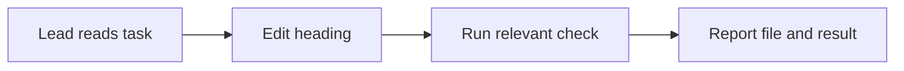
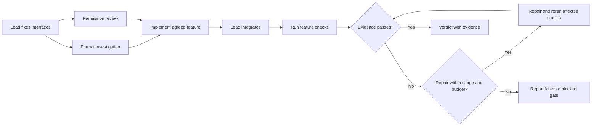
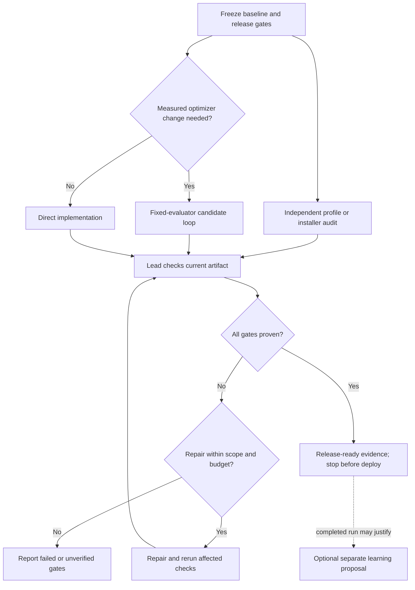

# How Agent Mission Control works

AMC helps one lead agent choose the smallest workflow that can finish and prove a
software task. It starts with the objective, constraints, and acceptance checks.
For an understood change, the lead works directly. For separate questions or
surfaces, it gives native subagents only the relevant task, inputs, authority,
owned files, and proof needed. The lead remains responsible for integration and
the final verdict.

A context pack is a focused handoff, not amnesia or a sandbox. A worker need not
receive unrelated history, but shared host instructions, available skills, and
permissions can still apply. See the reusable [packet](../templates/context-packet.md)
and [routing rules](../references/packets.md).

Routing is dynamic. A task may gain an investigation, a candidate loop, a fresh
review, or a repair only when that work can answer a real question. The lead may
choose an available model and effort suitable for a bounded job, but AMC makes no
promise about price, speed, or quality. Current files and executed checks—not a
worker saying “done”—decide the result.

These are illustrative routes, not recorded executions or mandatory pipelines.

## 1. A tiny edit stays tiny

**Prompt:** “Change the typo in the Settings heading and check the page still builds.”

There are no children, plans, or reviews to coordinate. The observable delivery
is the changed file and its build/check output.

## 2. A feature uses independent help

**Prompt:** “Add export. One person can examine the file format while another
checks the permission boundary; integrate the result and test it.”

The two jobs run together only because neither needs the other's answer. Their
deliverables are file anchors, findings, and reproducible checks. Shared editing
and integration remain serial, so agents do not overwrite each other.

## 3. A hard release adds gates only where needed

**Prompt:** “Prepare FPS Booster for release: improve p99 frametime, preserve
profiles on upgrade, and stop before deployment.”

Here the optimization loop is conditional: it exists only if p99 frametime has
a stable workload and evaluator. Profile preservation, rollback, crash guard,
and rendered UI need their own evidence; a passing build is insufficient. The
[FPS release example](../examples/fps-booster-release.md) is deliberately marked
as sample evidence, not a measured release. Learning is separate and optional:
it cannot silently rewrite the workflow that governed the release.

For long work, the lead keeps a compact, inspectable record of gates, current
artifact, commands, results, blockers, and next action in an existing tracker or
[Mission View](../templates/mission-view.md). On return, AMC reconciles it with
the workspace before trusting it. Its possible endings are `PASS`, `FAIL`,
`BLOCKED`, and `NOT VERIFIED`; only PASS means every applicable gate has current
evidence. The complete control rules live in [SKILL.md](../SKILL.md).
