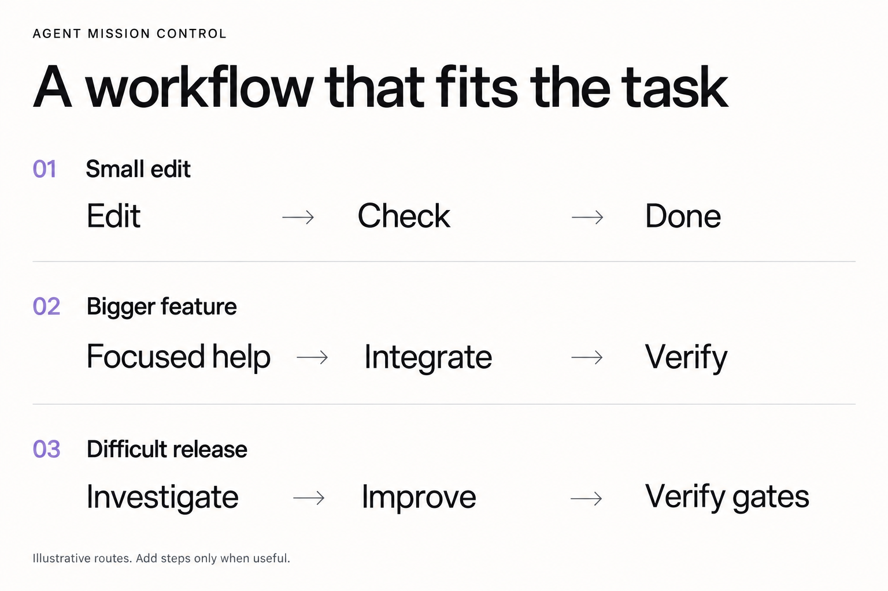
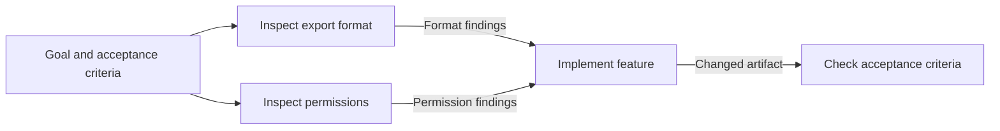

# How Agent Mission Control works

AMC helps one lead agent choose the smallest execution graph that can raise
verifiable capacity within the user's budget and still prove the result. It
starts with the objective, constraints, and acceptance checks.
For an understood sequential change, the lead works directly. That is a cautious
default, not a ban on extra agents. A specialist can bring focused expertise or
a fresh context; if it needs an earlier result, that result must be ready and
identified in the handoff. Parallel fan-out is only for
jobs that do not need each other's output. The lead gives each job the relevant
task, inputs, authority, owned files, and proof.
Parallel writers need host isolation (worktree, sandbox, VM or permissions);
otherwise the lead serializes. The lead remains responsible for integration and
the final verdict.

A context pack is a focused handoff, not amnesia or a sandbox. A worker need not
receive unrelated history, but shared host instructions, available skills, and
permissions can still apply. See the reusable [packet](../templates/context-packet.md)
and [routing rules](../references/packets.md).

Routing is dynamic. A task may gain an investigation, a candidate loop, a fresh
review, or a repair only when that work can answer a real question. The lead
chooses from the same three routes: direct work, one specialist, or independent
parallel jobs, then checks evaluator strength, error
risk, required capability, information value versus coordination cost, and
budget or authority. Direct, review, optimization and fan-out are
combinable mechanisms, not exclusive modes. The lead may choose an available
model and effort suitable for a bounded job, but AMC makes no promise about
price, speed, or quality. Current files and executed checks—not a worker saying
“done”—decide the result.

These are illustrative routes, not recorded executions or mandatory pipelines.
AMC is a portable **skill**, not a runtime SDK or graph framework. Hosts own
the loop, sandbox and traces. See [field state](field-state.md).

## Context and dependencies

Suppose a feature needs an export format and a permission check. Those two
investigations can read the same source independently. Implementation needs
both answers; acceptance needs the implemented artifact.

An edge means the next job needs a specific result. Merely giving two jobs
different role names does not create a dependency. The lead can perform any of
these steps directly; the diagram does not require four agents.

For a delegated investigation, the handoff contains the question, current source
identity, relevant entry points, read access, exclusive write scope (or none),
and what evidence to return. Load additional context when a real gap appears.
Return findings with source paths, unresolved facts and the next useful check;
do not send the full conversation by default. This is AMC's use of context and
graph engineering: enough information at the step that needs it.

The lead records decisions and accepted artifact identities in the existing
mission record. After interruption, it checks current files and writer status
before resuming. A summary cannot replace a file or revive stale test results.

## 1. A tiny edit stays tiny

**Prompt:** “Change the typo in the Settings heading and check the page still builds.”

**Route:** Lead edits the heading, runs the relevant check, and reports the result.

There are no children, plans, or reviews to coordinate. The observable delivery
is the changed file and its build/check output.

## 2. A feature uses independent help

**Prompt:** “Add export. One person can examine the file format while another
checks the permission boundary; integrate the result and test it.”

**Route:** Lead defines the interfaces; format investigation and permission review
run independently; implementation follows their findings; the lead integrates
and runs feature checks. Confirmed failures get a bounded repair and recheck.
If repair cannot continue within scope and budget, report the failed or blocked gate.

The two jobs run together only because neither needs the other's answer. Their
deliverables are file anchors, findings, and reproducible checks. Shared editing
and integration remain serial, so agents do not overwrite each other.

## 3. A hard release adds gates only where needed

**Prompt:** “Prepare FPS Booster for release: improve p99 frametime, preserve
profiles on upgrade, and stop before deployment.”

**Route:** Freeze the baseline and release gates; audit independent boundaries;
implement or run a measured candidate loop; inspect the current artifact and
verify every applicable gate. Repair within scope and budget, or report unresolved
gates. Stop before deployment as requested. A completed run may justify a separate
learning proposal.

Here the optimization loop is conditional: it exists only if p99 frametime has
a stable workload and evaluator. Profile preservation, rollback, crash guard,
and rendered UI need their own evidence; a passing build is insufficient.
When the thing the user runs is a generated package, the accept check runs on
that package. The
[FPS release example](../examples/fps-booster-release.md) is deliberately marked
as sample evidence, not a measured release. Learning is separate and optional:
it cannot silently rewrite the workflow that governed the release.

For long work, the lead keeps a compact, inspectable record of gates, current
artifact, commands, results, blockers, and next action in an existing tracker or
[Mission View](../templates/mission-view.md). On return, AMC reconciles it with
the workspace before trusting it. Its possible endings are `PASS`, `FAIL`,
`BLOCKED`, and `NOT VERIFIED`; only PASS means every applicable gate has current
evidence. The complete control rules live in [SKILL.md](../SKILL.md).
