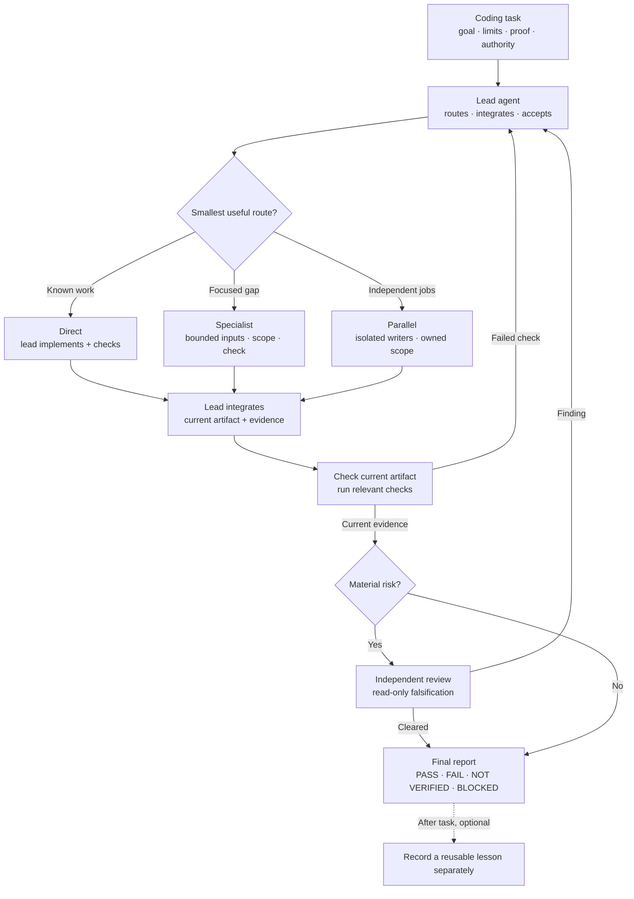

# Agent Mission Control — Markdown preview

One lead chooses the smallest useful route for each coding task. The host runs
the work; AMC is a portable skill, not a graph runtime.

## The main path

## Add only when needed

| Trigger | Lead adds |
| --- | --- |
| Scope is unclear | Scout maps dependencies and advises the lead. |
| Work was interrupted | Resume reconciles the saved record with current files. |
| A measurable goal has a frozen evaluator and baseline | An AVO-inspired loop runs a candidate, compares it, and keeps only a strict gain; otherwise the incumbent remains. |
| The next attempt is costly | A budget checkpoint weighs new evidence against attempt cost. |

The lead may reroute after new evidence. A PASS is an **advisory claim** backed
by current checks, not a release authorization. [Decision rules](how-it-works.md)
and [evidence limits](evidence.md) explain the boundaries.
